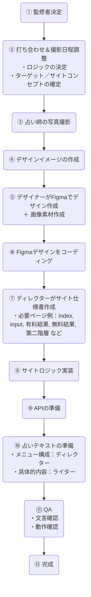
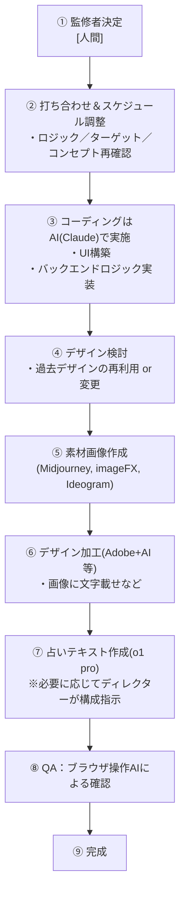

# 占いサイト制作フロー

## 既存フロー

### 既存フローの詳細

1. **監修者決定**
   - 企画の中心となる監修者を決定

2. **打ち合わせ＆撮影日程調整**
   - ロジック（占い方法）やターゲット層、サイトコンセプトを確認
   - 撮影日程の決定

3. **写真撮影**
   - 占い師（監修者）の写真や素材写真の撮影

4. **デザインイメージ作成**
   - 大枠のデザインコンセプトを固める

5. **Figmaでデザイン作成**
   - デザイナーがFigma上でワイヤーフレームからデザインまで落とし込む
   - ロゴやボタン等の個別画像素材も作成

6. **Figmaデザインをコーディング**
   - フロントエンドエンジニアがHTML/CSS/JS等でコーディング

7. **ディレクターがサイト仕様書作成**
   - 必要ページ一覧（index、入力ページ、結果ページなど）
   - 有料結果／無料結果の公開範囲、機能要件など

8. **サイトロジック実装**
   - 占い計算などバックエンド側のロジックを組み込む

9. **APIの準備**
   - 他システム連携がある場合、そのAPI周りの整備

10. **占いテキストの準備**
    - ディレクターがメニューの枠組みを決定
    - ライターが具体的内容（文章）を作成

11. **QA**
    - 文言や機能面の最終チェック
    - デバッグや修正を行う

12. **完成**

## AIでの新フロー

### 新フローの詳細

1. **監修者決定**
   - 人間が行う（どのAIを使用するかは監修者＆ディレクターが決定）

2. **打ち合わせ＆スケジュール調整**
   - 占いロジックやターゲット、コンセプトを再確認
   - 必要な機能やページ構成もディレクター／監修者が整理

3. **AI(Claude)によるコーディング**
   - フロントエンド（UI）とバックエンドロジックの一部をAIが生成
   - 必要に応じて人間が微調整

4. **デザイン検討**
   - 過去に作成したデザインを再利用するか、新たにAIで作るか方針決定

5. **素材画像作成**
   - 背景やボタンなど、Midjourney, imageFX, Ideogramなどを活用して生成

6. **デザイン加工**
   - Adobe系ツール＋AI機能でレイアウト調整・文字入れなど

7. **占いテキスト作成**
   - o1 pro 等の文章生成AIで作成
   - メニュー構成は人間（ディレクターなど）が最終調整

8. **QA**
   - ブラウザ操作AI (browser use, operator)を用いてテスト＆バグ修正

9. **完成**

## 追加で考慮すべきポイント

### ページ構成や課金ロジック
- 新フローでも、有料占い部分・無料占い部分の切り分け、課金導線などは事前にディレクターや監修者が設計しておく必要があります。

### APIの利用
- 外部連携や分析用にAPIを使う場合、AIでコーディングする際に必要なパラメータなどを事前に決めておきましょう。

### 最終的なデバッグ・セキュリティチェック
- AIが生成したコードにも、ヒューマンチェックやセキュリティ面のテストは欠かせません。
